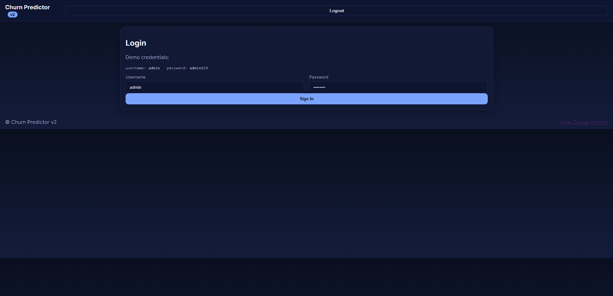
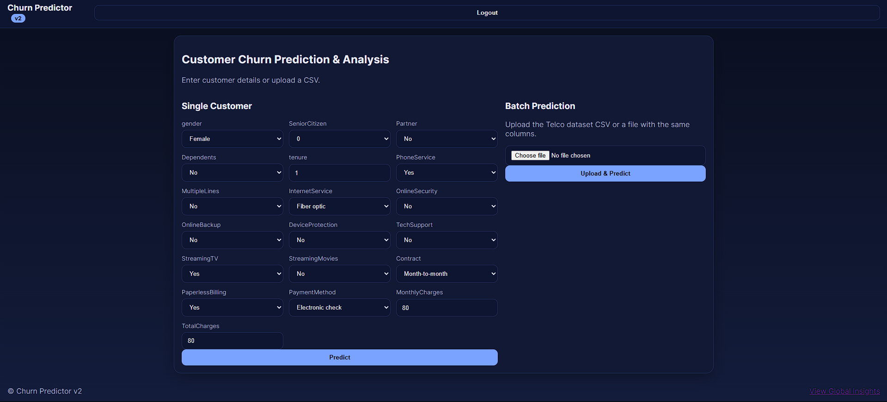

Customer Churn Prediction
Customer Churn Prediction is a modern web application that helps businesses analyze and predict customer churn using machine learning algorithms and real-world data. The project features a Python FastAPI backend, secure JWT authentication, interpretable churn risk explanations, and a responsive web frontend for easy use with both single customer entries and large batch CSVs.

UI Screenshots
Below are screenshots showing the application's user interface and core workflows:

1. Login Page

Overview: Secure login for authorized access, with demo credentials shown for easy testing.

Design: Clean, modern dark-themed layout; instant error feedback for incorrect login.

2. Prediction Dashboard

Single Customer Prediction: Enter details for one customer to get instant churn probability, churn risk level, driving factors, and recommended retention actions.

Batch Prediction: Upload standard CSV files to predict churn for multiple customers simultaneously.

Responsive Layout: The cards and forms adapt cleanly to various desktops and laptop screen sizes.

Global Insights: Easily reachable feature importance and business intelligence.

Replace the image paths above (./assets/login.png, ./assets/dashboard.png) with the correct file paths in your repository.

Features
Real Dataset Integration: Uses the IBM Telco Customer Churn dataset for realistic customer segmentation and prediction.

Machine Learning Model: Trains and deploys XGBoost (if available) or Logistic Regression for highly accurate churn prediction.

Secure API Backend: FastAPI service with JWT-based login/logout and protected endpoints.

Single and Batch Prediction: Predict churn for individual customers or entire datasets via the web interface.

Explainable AI: Displays top features driving each churn prediction and actionable recommendations.

Global Feature Insights: Shows the most important contributing factors to churn across all customers.

Responsive Web Frontend: Built with HTML, CSS, and JavaScript. Automatically adapts to modern browsers and screen sizes.

Deployable Locally: Runs on standard Windows/Linux/macOS environments.

Tech Stack
Backend:

Python 3.8+

FastAPI

Uvicorn

Pandas, NumPy, scikit-learn, XGBoost (optional)

JWT (python-jose)

passlib

Frontend:

HTML5

CSS3

JavaScript (vanilla)

Data:

IBM Telco Customer Churn dataset (downloaded to data folder on training)

Prerequisites
Python 3.8+

pip (package installer)

git (for cloning)

Modern web browser (Chrome, Firefox, Edge, Safari)

Setup and Installation
Clone the Repository:

bash
git clone https://github.com/vaibhavh27/Customer-Churn-Analysis.git
cd Customer-Churn-Analysis
Create and Activate a Virtual Environment:

bash
python -m venv .venv
# Windows:
.\.venv\Scripts\Activate.ps1
# macOS/Linux:
source .venv/bin/activate
Install Dependencies:

bash
pip install -r requirements.txt
Train the Model:

bash
python -m backend/model/train
This script downloads the IBM Telco dataset, prepares and trains the ML model, then saves all artifacts to the backend’s artifacts directory.

Start the Backend API:

bash
python -m uvicorn backend.app:app --reload
The API will run at http://127.0.0.1:8000/

Serve the Frontend:
Open a new terminal in the frontend fo

bash
cd frontend
python -m http.server 5500 --bind 127.0.0.1
Then go to http://127.0.0.1:5500/index.html in your browser.

Project Structure
text
Customer-Churn-Analysis/
├── backend/
│   ├── app.py
│   ├── model/
│   │   ├── train.py
│   │   ├── preprocess.py
│   │   ├── reason.py
│   │   ├── recommend.py
│   │   └── artifacts/
│   │       ├── model.pkl
│   │       ├── preprocessor.pkl
│   │       └── columns.json
│   └── auth.py
│   └── settings.py
├── data/
│   └── telco_customer_churn.csv
├── frontend/
│   ├── index.html
│   ├── app.js
│   └── styles.css
├── requirements.txt
└── README.md
API Endpoints
POST /auth/login
Authenticate users, returns JWT on success.

POST /predict
Takes a single customer data row and returns churn probability, risk class, key reasons, and target recommendations.

POST /predict_batch
Accepts a CSV file, returns churn predictions and explanations for each row.

GET /insights
Returns global feature importance rankings.

Troubleshooting
Back-end not running? Make sure ML model has been trained and all dependencies are installed.

Login errors? Ensure you’re using correct credentials (admin / admin123 by default) and API is active.

CSV upload issues? Verify required columns and format match the IBM dataset structure.

Future Enhancements
Full mobile device compatibility

Interactive charts for feature insights

Downloadable reports in PDF/CSV format

User registration and personalized dashboards

Multi-model support and hyperparameter selection from UI

License
MIT License. Free for academic, research, and commercial use.

Credits
Developed by Vaibhav Hingnekar
Dataset: IBM Telco Customer Churn

Explore churn analytics and actionable business intelligence on real-world customer data in seconds.

Let me know if you want more sections (contributors, FAQ, or badges) or want any details expanded
